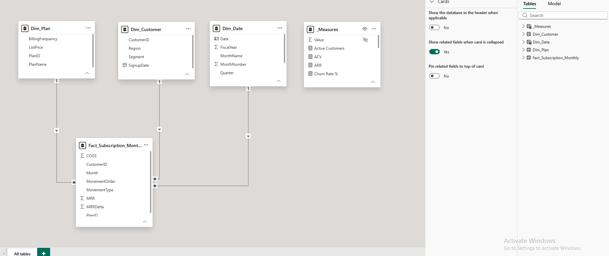
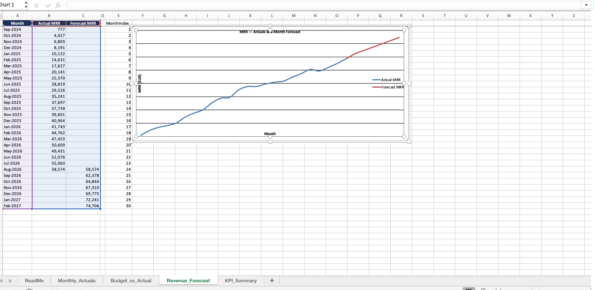
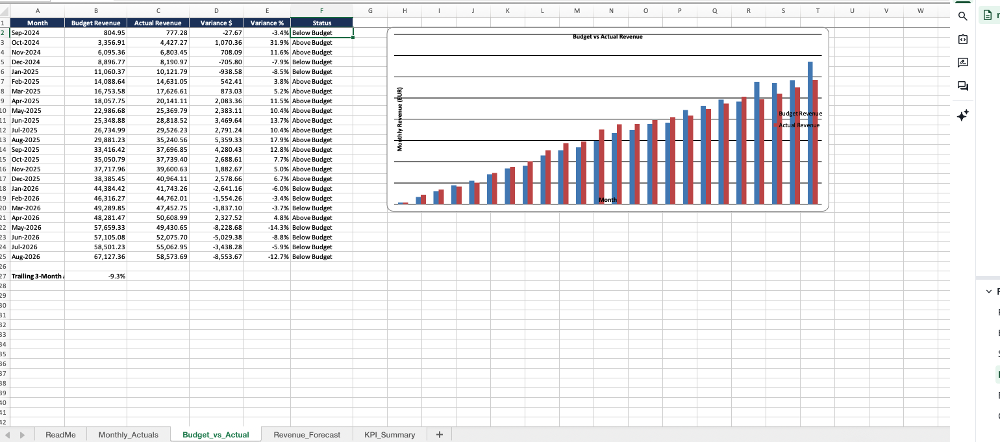

# SaaS Finance & Revenue Analytics Dashboard

An end-to-end SaaS finance analytics project built with Excel and Power BI, covering budget vs. actual analysis, revenue forecasting, a relational data model, and a management-style KPI dashboard for a subscription (SaaS) business.

The project uses synthetic sample data (24 months, ~180 customers) generated for practice. It is not real company data.

## What this project covers

- Excel financial model: monthly actuals, budget vs. actual variance analysis, and a 6-month linear revenue forecast, all driven by live formulas rather than static values.
- Power BI dashboard: a star-schema data model built from four source tables, cleaned and harmonized in Power Query, with DAX measures for the core SaaS KPIs.
- Data quality and harmonization: a documented, repeatable process for catching and fixing bad data (duplicate rows, missing cost values, inconsistent text casing) before it reaches a report.

## Tech stack

| Area | Tools |
|---|---|
| Data prep and cleaning | Power Query (column profiling, trimming, harmonization, deduplication) |
| Data modeling | Power BI (star schema, relationships, DAX) |
| Financial modeling | Excel (formulas, FORECAST.LINEAR, variance analysis) |
| Reporting | Power BI report pages, Excel KPI summary |

## Data model

A textbook star schema: one fact table surrounded by three dimension tables, each joined on a single key in a one-to-many relationship.

- Fact_Subscription_Monthly: monthly MRR, MRRDelta, COGS, and movement type per customer
- Dim_Customer: customer, segment, region, signup date
- Dim_Plan: plan name, billing frequency, list price
- Dim_Date: calendar table marked as the model's date table



## KPI glossary

| KPI | Definition |
|---|---|
| MRR | Monthly Recurring Revenue: SUM(Fact_Subscription_Monthly[MRR]) |
| ARR | Annual Recurring Revenue: MRR x 12 |
| ACV | Average Contract Value: ARR / Active Customers |
| Gross Margin % | (Revenue - COGS) / Revenue |
| Churn Rate % | Churned MRR / Prior Period MRR (revenue churn) |
| Net Revenue Retention (NRR) | (Prior MRR + Expansion - Contraction - Churn) / Prior MRR, measured on the existing customer base |
| Revenue movements | The month-over-month change in MRR broken into New, Expansion, Contraction, Churned, and Reactivation components |

## Core DAX measures

```dax
Total MRR = SUM(Fact_Subscription_Monthly[MRR])
ARR = [Total MRR] * 12

New MRR = CALCULATE(SUM(Fact_Subscription_Monthly[MRRDelta]), Fact_Subscription_Monthly[MovementType] = "New")
Expansion MRR = CALCULATE(SUM(Fact_Subscription_Monthly[MRRDelta]), Fact_Subscription_Monthly[MovementType] = "Expansion")
Contraction MRR = CALCULATE(SUM(Fact_Subscription_Monthly[MRRDelta]), Fact_Subscription_Monthly[MovementType] = "Contraction")
Churned MRR = -1 * CALCULATE(SUM(Fact_Subscription_Monthly[MRRDelta]), Fact_Subscription_Monthly[MovementType] = "Churn")
Reactivation MRR = CALCULATE(SUM(Fact_Subscription_Monthly[MRRDelta]), Fact_Subscription_Monthly[MovementType] = "Reactivation")

Net New MRR = [New MRR] + [Expansion MRR] + [Contraction MRR] - [Churned MRR] + [Reactivation MRR]

Total COGS = SUM(Fact_Subscription_Monthly[COGS])
Gross Margin $ = [Total MRR] - [Total COGS]
Gross Margin % = DIVIDE([Gross Margin $], [Total MRR])

Active Customers = CALCULATE(DISTINCTCOUNT(Fact_Subscription_Monthly[CustomerID]), Fact_Subscription_Monthly[MRR] > 0)
ACV = DIVIDE([ARR], [Active Customers])

Prior Month MRR = CALCULATE([Total MRR], DATEADD(Dim_Date[Month], -1, MONTH))
Churn Rate % = DIVIDE([Churned MRR], [Prior Month MRR])
Net Revenue Retention % = DIVIDE([Prior Month MRR] + [Expansion MRR] + [Contraction MRR] - [Churned MRR], [Prior Month MRR])
```

## Data quality and harmonization

Before the raw source tables reached the model, they went through a documented cleanup pass in Power Query:

- Duplicate row: found via Power Query's column-quality profiling and removed.
- Missing COGS value: one null cost value identified and defaulted to 0 pending source correction.
- Inconsistent region casing ("emea", " EMEA ", "EMEA"): trimmed and standardized to a single consistent value.
- Redundant attributes: Segment, Region, and PlanID removed from the fact table since they're already reachable through the dimension tables, keeping the star schema clean.

## Dashboard pages

1. Overview: headline KPI cards (ARR, MRR, Gross Margin %, Active Customers, NRR %, Churn Rate %), a Total MRR trend line, and segment/region slicers.
2. Revenue Movements: a waterfall chart and matrix breaking down the MRR bridge (New / Expansion / Contraction / Churned / Reactivation) by month.
3. Segments & Plans: MRR and active customers broken down by segment, region, and plan.
4. Profitability: Gross Margin % trend (with a built-in Power BI forecast) alongside Total MRR vs. Total COGS.

## PDF

The four main report pages (Overview, Revenue Movements, Segments & Plans, Profitability) are exported together as a single PDF for a full-resolution view.

[View dashboard pages (PDF)](SaaS Finance & Revenue Analytics Dashboard.pdf)

## Excel financial model

The Excel workbook (SaaS_Finance_Model.xlsx) is a live financial model with four sheets:

- Monthly_Actuals: the source-of-truth monthly table (ARR, Gross Margin $/%, Churn Rate %, NRR %).
- Budget_vs_Actual: actual revenue pulled by cell reference from Monthly_Actuals, with $ and % variance and an above/below-budget flag.
- Revenue_Forecast: a 6-month forward projection using FORECAST.LINEAR() over the trailing 24 months of actuals.
- KPI_Summary: a one-page rollup where every cell is a formula referencing another sheet.




## Repository contents

| File | What it is |
|---|---|
| README.md | This file |
| SaaS_PowerBI_SourceData.xlsx | Power BI source data (4 tables in one workbook) |
| dim_customer.csv | Customer dimension (standalone CSV version) |
| dim_plan.csv | Plan dimension (standalone CSV version) |
| dim_date.csv | Date dimension (standalone CSV version) |
| fact_subscription_monthly.csv | Monthly subscription fact table (standalone CSV version) |
| SaaS_Finance_Model.xlsx | Excel financial model (actuals, budget vs. actual, forecast, KPI summary) |
| SaaS Finance & Revenue Analytics Dashboard.pbix | The Power BI dashboard file |
| SaaS Finance & Revenue Analytics Dashboard.pdf | Export of the 4 main dashboard pages |
| data-model.png | Screenshot of the Power BI data model |
| power-query.png | Screenshot of the Power Query cleanup steps |
| revenue-forecast.png | Screenshot of the Excel revenue forecast |
| budget-vs-actual.png | Screenshot of the Excel budget vs. actual sheet |

## How to explore this project

1. Open SaaS_Finance & Revenue Analytics Dashboard.pbix in Power BI Desktop (free) to browse the live model, DAX measures, and report pages.
2. Open SaaS_Finance_Model.xlsx in Excel to see the underlying financial model and formulas.
3. SaaS_PowerBI_SourceData.xlsx and the CSV files are the source data used for the Power BI import.

## Disclaimer

All figures (ARR, MRR, ACV, Gross Margin, etc.) are generated from synthetic sample data for practice and portfolio purposes. They do not represent any real company's financials.
